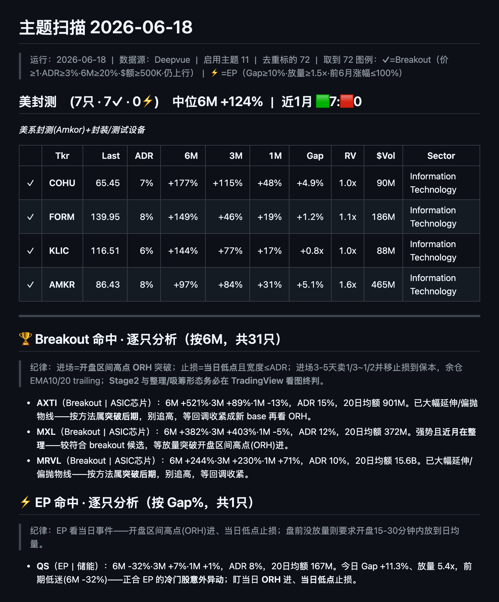

# Qullamaggie Screener & Skill

[](https://github.com/HenryVarro666/qullamaggie-screener/actions/workflows/validate.yml)
[](LICENSE)

**A Qullamaggie (Kristjan Kullamägi) swing-trading toolkit** — a Claude Code *skill* that
coaches the method on TradingView, plus an optional auto-scanner that builds a daily
**Breakout / EP** watchlist. Works with or without Deepvue.

**Qullamaggie 趋势交易工具箱** —— 一个在 TradingView 上执行该方法的 Claude Code *skill*，外加一个
可选的自动扫描器，每天产出 **Breakout / EP** 候选清单。**有没有 Deepvue 都能用。**

> ⚠️ **Not financial advice / 非投资建议.** Educational & personal-research use only. Trading
> involves risk of loss. The method is Kristjan Kullamägi's; this repo just helps you execute it.

---

## 📊 Example daily report / 每日报告示例

The scanner writes a heatmap-style markdown report grouped by theme, with per-stock
**Breakout ✓ / EP ⚡** flags, analysis, and an embedded **TradingView daily chart** per pick. (The
TradingView fallback produces the same screen, done by hand.) 扫描器输出按主题分组的每日报告，每只带
Breakout/EP 标记、分析与一张 TradingView 日K图：



---

## What's inside / 仓库内容

| Path | What it is |
|--|--|
| `skills/qullamaggie-swing-trading/` | The **Claude Code skill** — method, screening, entry/stop/exit, risk sizing, market-environment gating. Chinese. |
| `skills/.../references/tradingview-screener.md` | **No-Deepvue TradingView fallback** — how to screen Breakout/EP in TradingView's built-in screener. |
| `skills/.../assets/*.pine` | TradingView Pine: market-environment regime + a Breakout/EP flag-and-alert helper. |
| `scanner/` | **Optional** auto-scanner (TradingView no-login, or Deepvue). **`daily.py`** = one combined daily report (theme heatmap + *"buyable Top 10"* + whole-market Top-N), each hit with a daily chart + a **formation-health** read (accumulation vs distribution). |

---

## Three ways to use it / 三种用法

### A. As a Claude Code skill (everyone) / 当 Claude Code 陪练（人人可用）
Install the skill, then ask Claude things like *"NVDA 现在算不算 breakout？在哪进场、止损放哪？"*
or *"现在大盘能不能交易？"* — it answers strictly from the method.

**Install / 安装:**
```bash
git clone https://github.com/HenryVarro666/qullamaggie-screener.git
# copy the skill into your Claude Code skills dir:
cp -R qullamaggie-screener/skills/qullamaggie-swing-trading ~/.claude/skills/
```
Or use it as a plugin (the repo ships a `.claude-plugin/plugin.json`). Manual copy above is the
reliable path.

### B. Auto-scanner — TradingView backend, **no login** (everyone) / 自动扫描（TradingView，免登录）
Runs on **TradingView's public scan endpoint by default — no account, no token**. **`daily.py`** writes
**one** combined daily report: market regime → theme heatmap → *"buyable Top 10"* → whole-market Breakout
Top-N, every hit with a **chart** + a **formation-health** read (healthy base vs distribution — numeric,
plus optional Gemini chart-vision). Single-view scripts (`theme_scan` / `ready_top10` / `breakout_top10`)
remain if you want just one slice.

> *Buyable Top 10* = Breakouts **coiling near the highs, ready to go** — not the over-extended names a
> 6-month ranking floats to the top. Charts use **your own TradingView indicators** if you drop in a
> (git-ignored) `tv_cookies.json`, else a mplfinance self-draw.

扫描器默认走 **TradingView 公开接口，无需登录/账号**。`daily.py` 出**一份合并日报**（市场环境 → 主题热力图
→ 可买Top10 → 全市场Top），每只带日K图 + 形态健康度。
```bash
pip install -r requirements.txt                         # requests + playwright + mplfinance
cp scanner/themes.example.json ~/.deepvue/themes.json   # backend already "tradingview"
python3 scanner/daily.py                                # ⭐ one combined report (CHARTS=0 to skip charts)
```
See **[`scanner/README.md`](scanner/README.md)**. (Prefer a manual workflow? The TradingView Stock
Screener guide is in [`tradingview-screener.md`](skills/qullamaggie-swing-trading/references/tradingview-screener.md),
plus `assets/breakout-ep-flags.pine` for per-symbol chart alerts.)

### C. Deepvue backend (optional, own paid account) / Deepvue 后端（可选，自备账号）
For real-time data + exact ADR, set `"backend": "deepvue"` in `themes.json` and supply your session
per **[`scanner/AUTH_SETUP.md`](scanner/AUTH_SETUP.md)** (`pip install playwright && playwright install chromium`).
⚠️ Drives **your own** logged-in session; subject to **Deepvue's Terms of Service**. Personal use only.

---

## The method in one screen / 一屏看懂口径

- **Breakout ✓**: big prior move → orderly tightening pullback hugging rising MAs → volume
  breakout. Screen ≈ `price≥1 · ADR%≥3 · 6M perf≥20% · 20d $vol≥$1M · within 25% of 52w high ·
  Stage 2 (above 50- & 200-day MA, 50>200)`.
- **EP ⚡** (Episodic Pivot): earnings-driven gap on a quiet stock. Screen ≈ `gap≥10% ·
  rel-vol≥1.5 · prior 6M not already run · recent earnings (≤5d) + strong EPS growth (≥25%)`.
  (`ep_rules.require_earnings:false` re-includes non-earnings catalysts.)
- **Entry** = open-range high (ORH). **Stop** = day's low, width ≤ ADR. **Exit** = sell ⅓–½ in
  3–5 days + move stop to breakeven, trail the rest on EMA10/20. Risk ≤ 0.5% of account per trade.
- Only in a **bull market** (QQQ/NDX weekly), only **hot themes**, only **Stage 2** leaders.

Full detail lives in the skill's `references/`.

---

## Disclaimers / 免责

- **Not financial advice.** For education and personal research only.
- **Deepvue scanner** requires your own **paid** account and respects Deepvue's ToS. No
  credentials are included in this repo (they live locally and are git-ignored).
- ✓/⚡ are **numeric screens only** — always confirm Stage 2 and the actual base/consolidation
  on the chart before acting.
- Data is only as good as its source.

## Credits / 致谢
Method by **Kristjan "Qullamaggie" Kullamägi** (qullamaggie.com). Packaged by
[@HenryVarro666](https://github.com/HenryVarro666). MIT licensed.
